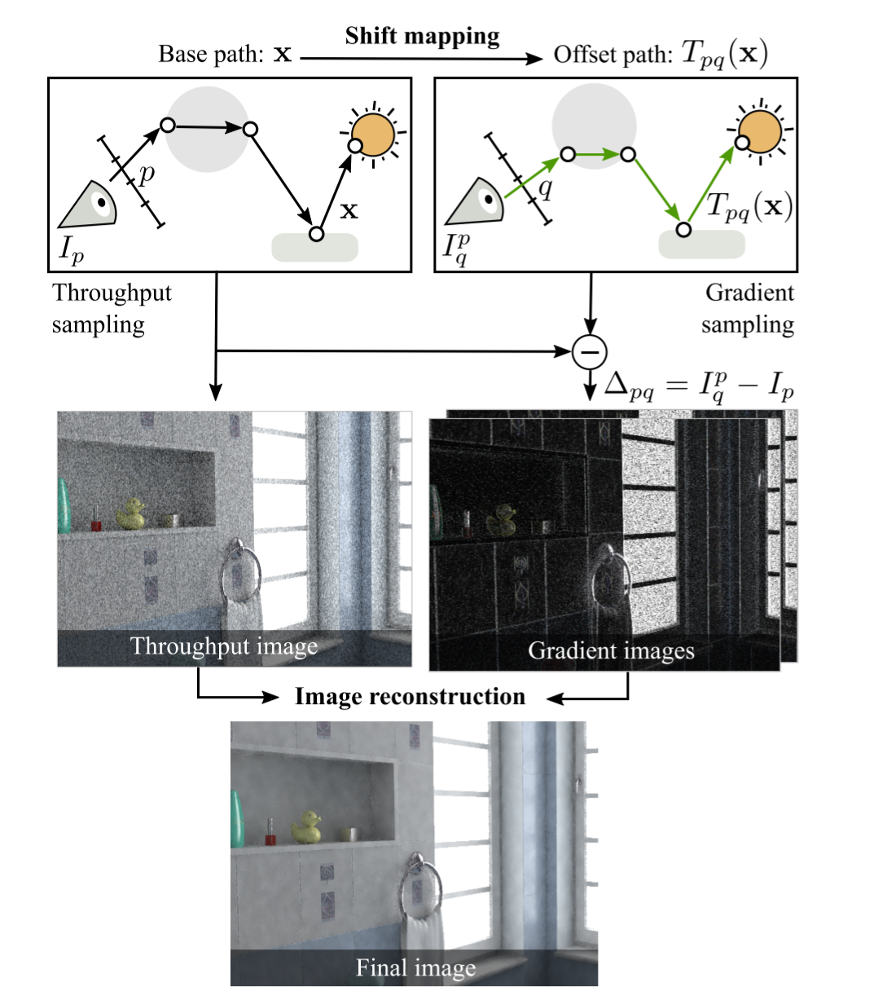
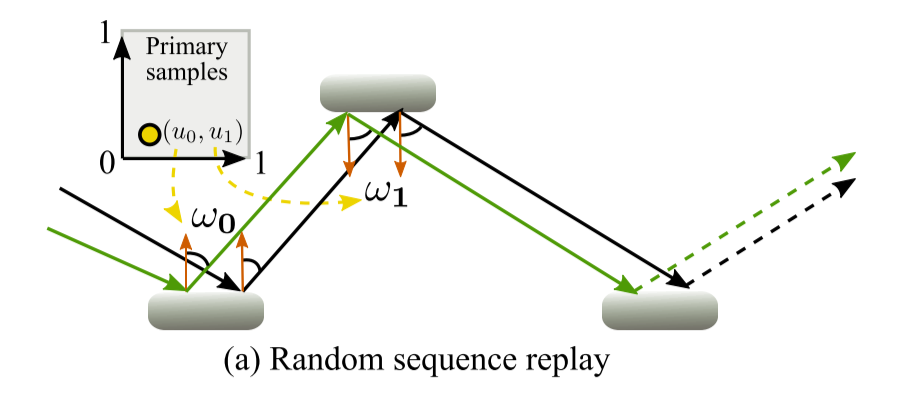
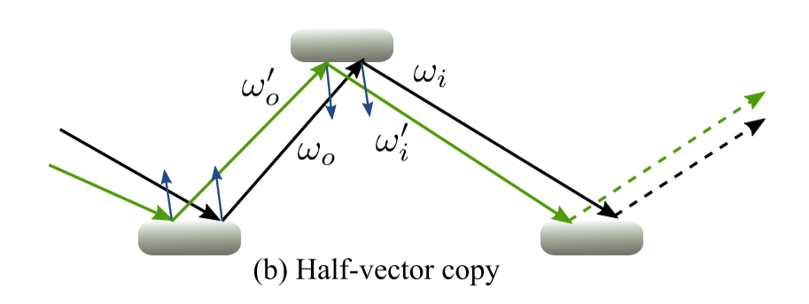
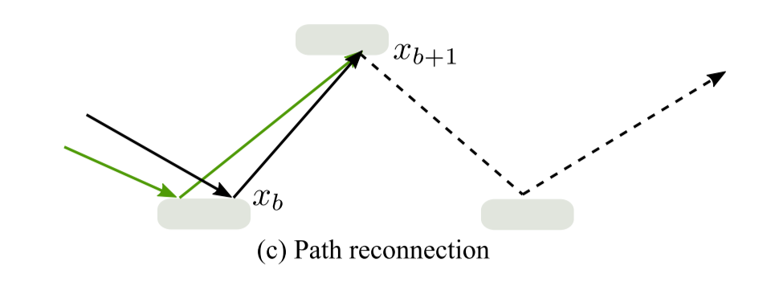
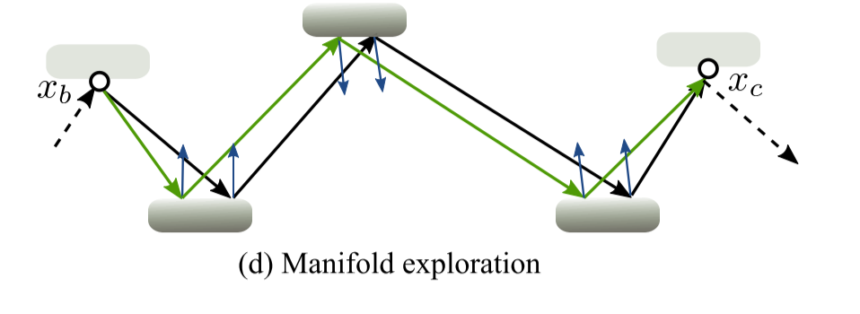

# 一、梯度域方法概述
梯度域方法是一种“降噪”方法，其主要目的是加快基于 MonteCarlo 采样的收敛效率，基于梯度域的方法主要通过以下流程实现：
1. 计算初始图像
2. 计算梯度图像
3. 对初始图像和梯度图像进行图像重构
4. 得到最终结果
  
其具体例子可见图1

# 二、关于基于梯度域方法的三大要素
## 初始渲染算法
初始渲染算法决定了路径的生成和初始图像的计算。
## $Shift$函数
Shift 函数决定如何根据 base path 来生成 offset path。
## 雅可比行列式
雅可比行列式用来矫正在 Offset Path 相对于 Base Path 的路径密度改变。

其中 Offset 路径的贡献值的计算公式如下:
$$
\begin{aligned} I_{j+1} &=\int_{\Omega} h_{j+1}(\overline{x}) f^{*}(\overline{x}) \mathrm{d} \mu(\overline{x}) \\ &=\int_{T_{1,0}^{-1}(\Omega)} h_{j+1}\left(T_{1,0}(\overline{x})\right) f^{*}\left(T_{1,0}(\overline{x})\right) \mathrm{d} \mu\left(T_{1,0}(\overline{x})\right) \\ &=\int_{\Omega} h_{j+1}\left(T_{1,0}(\overline{x})\right) f^{*}\left(T_{1,0}(\overline{x})\right) \frac{\mathrm{d}\left\{\mu \circ T_{1,0}\right\}}{\mathrm{d} \mu}(\overline{x}) \mathrm{d} \mu(\overline{x}) \\ &=\int_{\Omega} h_{j}(\overline{x}) f^{*}\left(T_{1,0}(\overline{x})\right) \frac{\mathrm{d}\left\{\mu \circ T_{1,0}\right\}}{\mathrm{d} \mu}(\overline{x}) \mathrm{d} \mu(\overline{x}) \end{aligned}\tag{1}
$$

则路径 $\overline{x}$ 的路径差 $I_j^{dx}$ 为：
$$
\begin{array}{l}{I_{j}^{\mathrm{d} x}=I_{j+1}-I_{j}=} \\ {\int_{\Omega} h_{j}(\overline{x})\left[f^{*}\left(T_{1,0}(\overline{x})\right) \frac{\mathrm{d}\left\{\mu \circ T_{1,0}\right\}}{\mathrm{d} \mu}(\overline{x})-f^{*}(\overline{x})\right] \mathrm{d} \mu(\overline{x})}\end{array}\tag{2}
$$

# 三、Shift函数
根据 [GD-Path Tracing](https://mediatech.aalto.fi/publications/graphics/GPT/) 中的频率分析，offset path 与 base path 关联性越大，其重构后的方差就越小，最终呈现出的结果也就越好。

## 1、随机数复用
像素 $ i $ 产生路径 $\overline{x}$ 所使用的随机序列记为 $\overline{U}$，重复使用该随机序列来产生对应的 offset path $\widetilde{x}$。

## 2、半向量保留
保留 base path 中每个顶点的半向量（**局部空间**），根据半向量，入射向量，可以直接计算得到出射方向。

## 3、路径重连（Vertex reconnection）
只在 S 表面上进行 offset（S表面能量分布的lobe过窄，直接连接其路径能量大概率可能携带能量为0），对于 D 表面，直接重连这些 D 顶点。

## 4、Manifold Perturbation （详见 Manifold Exploration）

几种基于 Gradient - Domain 的方法在构建 offset path 上都采用了上述的一种或多种（主要为后三种）Shift 函数，并根据选择的基础算法不同进行了一定的修改。
# 四、不同算法中Shift函数的应用以及具体调整

## 1、GD - MLT
使用 Markov Chain Monte Carlo 的方法对目标函数 $ f(\overline{x})$进行采样。传统的 MLT 方法对于目标函数只考虑了像素路径的能量贡献，但是在 GD - MLT中的目标函数还考虑了梯度的变化。

在梯度变化大的地方着重采样能明显提高效率，上图中，GD - MLT 在采样重心更多的放在了阴影处。

### 1.1、Shift 函数
1. 对于像素 $i$ 的 base path $\overline{x}$ 寻找前三个 D 顶点 $X_a, X_b, X_c$
2. 根据像素 $j$ （$i$像素在屏幕空间的偏移像素）从 $X_a$ 处生成一条新的光线
3. 在 $X_a $ ~ $X_b$ 的 Specular Chain 中进行 ray tracing， 以此生成新的 $X_a$ ~ $ X_b^{off}$ 路径。
4. 对于 $X_b^{off}$ ~ $X_c$ 路径，采取 Manifold Exploration 来确保 $X_c$ 点不变

上述过程即为 **Manifold Perturbation**。 

### 1.2、目标函数
定义 $ \overline{z}$ 为：

$$
\overline{z} = \left \{ \overline{x}, f_x, f_y \right\}
$$
其中 $f_x$ 与 $f_y$ 为 base path 在 x,y 方向上对应的 offset path。
则GD-MLT的目标函数为
$$
f(\overline{z})=\left\|f^{*}(\overline{z})\right\|+\alpha\left(\frac{1}{4}\left\|f^{*}(\overline{x})\right\|\right)\tag{3}
$$
其中第一项考虑了路径的梯度变化，第二项考虑了路径的能量贡献，而 $\alpha$ 代表自定义系数。

## 2、GD - PT

### 2.1、Shift 函数
不采用 manifold exploration，而是采用半向量保留和路径顶点重连的方案。

# 五、雅可比行列式

# 六、Shift函数的开销和对比

# 七、GD- 算法分析

# 八、可研究点